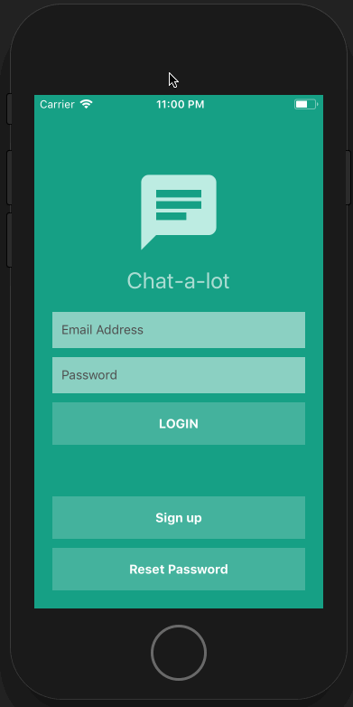

# React Native Expo Firebase Chat
Simple and Clean one-to-one messenger and chat rooms



This app is a one-to-one chat service using the Firebase Realtime Database for instant data. The chat rooms feature will be added in the future.

The app was bootstrapped with [Create React Native App](https://github.com/react-community/create-react-native-app) and is running on Expo.

## Configuration
Add a `config/firebase.js` file with the following content (make sure to fill in the values from your own firebase account):

```js
export default {
  API_KEY: <API_KEY>,
  AUTH_DOMAIN: <AUTH_DOMAIN>,
  DATABASE_URL: <DATABASE_URL>,
  PROJECT_ID: <PROJECT_ID>,
  STORAGE_BUCKET: <STORAGE_BUCKET>,
  MESSAGING_SENDER_ID: <MESSAGING_SENDER_ID>,
};
```

## How to run the app (pick an option)
### 1. Run the app locally using the Expo XDE app (My preferred way):
  - Install the Expo XDE app from https://docs.expo.io/versions/latest/introduction/installation
  - Open the Expo XDE app
  - Choose `Open existing project`
  - Choose the root folder location
  - This will spin up the packager
  - To view the app on a mobile device, open the Expo App on your mobile device and choose the project
  - To view the app in the simulator, click on `Device` in the Expo XDE app and choose `Open on iOS Simulator` or `Open on Android`.

### 2. Run the app from the command line:
  - Run `npm install -g exp` to install the Expo CLI globally
  - Navigate to the root folder location
  - To view the app on a mobile device:
      - Run `exp start` and open the Expo App on your mobile device and choose the project
  - To view the app in the simulator:
    - For iOS, run `exp ios`
    - For Android, run `exp android`

###  3. Use the `yarn start`, `yarn ios`, or `yarn android` tasks as detailed below.

  ## Available Scripts

  This app was initialized using Yarn and therefore you should use Yarn commands going forward.

Below you'll find information about performing common tasks.

* [Available Scripts](#available-scripts)
  * [yarn start](#npm-start)
  * [yarn ios](#npm-run-ios)
  * [yarn android](#npm-run-android)

  ### `yarn start`

  Runs your app in development mode.

  Open it in the [Expo app](https://expo.io) on your phone to view it. It will reload if you save edits to your files, and you will see build errors and logs in the terminal.

  Sometimes you may need to reset or clear the React Native packager's cache. To do so, you can pass the `--reset-cache` flag to the start script:

  ```
  yarn start --reset-cache
  ```

  #### `yarn ios`

  Like `yarn start`, but also attempts to open your app in the iOS Simulator if you're on a Mac and have it installed.

  #### `yarn android`

  Like `yarn start`, but also attempts to open your app on a connected Android device or emulator. Requires an installation of Android build tools (see [React Native docs](https://facebook.github.io/react-native/docs/getting-started.html) for detailed setup).
